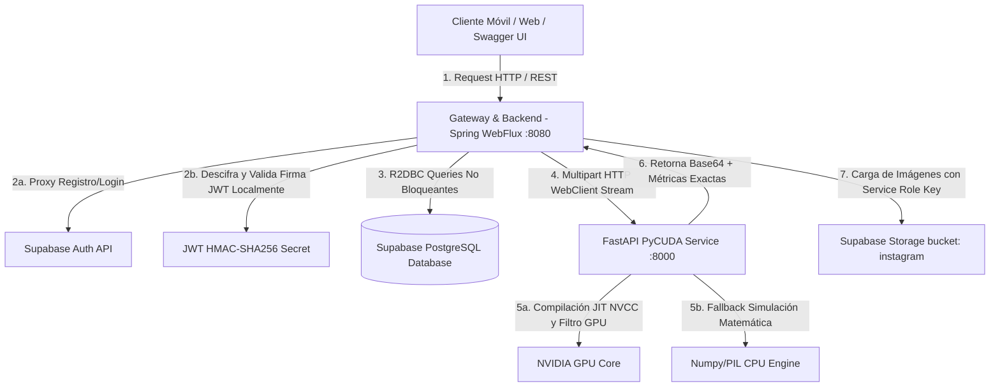

# Guía de Arquitectura y Funcionamiento Detallado - Instagram Clone Reactive Backend

Este documento sirve como manual técnico detallado para que desarrolladores humanos, colaboradores y agentes de Inteligencia Artificial en futuras sesiones puedan comprender en profundidad el diseño de software, los flujos de datos y la integración de hardware de esta aplicación.

---

## 🗺️ 1. Arquitectura del Sistema

La aplicación está diseñada bajo una **arquitectura de microservicios desacoplados** orquestados mediante contenedores Docker, combinando la programación reactiva no bloqueante en Java y el procesamiento paralelo de alto rendimiento en C++/CUDA.



---

## ⚡ 2. El Orquestador Reactivo (Spring WebFlux)

El backend de Java está construido en su totalidad sobre **Spring Boot 3.2.x y Spring WebFlux** para operar bajo un paradigma de **programación reactiva y asíncrona no bloqueante**.

### Conceptos Clave Implementados:
1. **R2DBC (Reactive Relational Database Connectivity)**: A diferencia de JDBC convencional (que bloquea un hilo por cada consulta), R2DBC utiliza controladores totalmente reactivos basados en Netty. El hilo del servidor nunca se bloquea esperando la respuesta de PostgreSQL, lo que permite manejar decenas de miles de peticiones simultáneas con un consumo mínimo de RAM.
2. **Sincronización Concurrente mediante `Mono.zip`**: Al compilar el Feed de publicaciones (`GET /api/publications/feed`), el servidor ejecuta en paralelo la consulta del perfil del creador, el conteo total de likes y la comprobación de si el usuario logueado dio like, combinando todos los editores reactivos de forma inmediata sin bloqueos.
3. **Manejo de Archivos en Memoria Segura**: Los archivos multipart se reciben mediante streams no bloqueantes `FilePart`. Para evitar fugas de memoria o sobrecargar la RAM del contenedor, el contenido se procesa de forma reactiva liberando los búferes de bytes (`DataBufferUtils.release`) inmediatamente después de ensamblar la imagen.

---

## 🔑 3. Seguridad y Autenticación Distribuida

El backend implementa un sistema híbrido que saca el máximo provecho de Supabase Auth sin sacrificar rendimiento:

1. **Registro e Inicio de Sesión**: Cuando un usuario se registra o inicia sesión, Spring actúa como un proxy reactivo hacia la API REST de Supabase Auth. 
   - Durante el registro, en cuanto Supabase crea la cuenta, el backend intercepta el resultado y registra de forma inmediata un perfil idéntico en la tabla local `profiles` con el mismo `UUID`, manteniendo consistencia relacional.
2. **Validación Local de Firmas JWT (Cero Latencia)**: Supabase firma todos los tokens de usuario utilizando un secreto HMAC-SHA256. 
   - En lugar de hacer una petición de red lenta a Supabase por cada consulta del cliente, el componente `JwtAuthenticationWebFilter` extrae el token de la cabecera `Authorization: Bearer <TOKEN>`.
   - Utilizando la librería `jjwt` y la variable `SUPABASE_JWT_SECRET`, el backend valida la firma digital localmente en microsegundos y guarda el UUID del usuario autenticado en el contexto de seguridad reactivo de Spring (`ReactiveSecurityContextHolder`).

---

## ⚡ 4. El Motor de Procesamiento de Imágenes (PyCUDA & FastAPI)

El procesamiento pesado de imágenes está completamente delegado al microservicio en Python (`cuda-service`), combinando **FastAPI** (asíncrono) con la potencia de compilación dinámica de **PyCUDA**.

### pipeline de Carga y Procesamiento:
```text
[Cliente] --> (Sube Imagen) 
   --> [Spring WebFlux] (Recibe archivo asíncrono)
   --> [Spring WebFlux] (Envía Multipart a http://cuda-service:8000/process)
   --> [FastAPI] (Recibe imagen y lee canal RGB)
   --> [PyCUDA / CPU Fallback] (Aplica filtro matemático y mide milisegundos)
   --> [FastAPI] (Retorna imagen Base64 + métricas)
   --> [Spring WebFlux] (Carga original y filtrada en Supabase Storage)
   --> [Spring WebFlux] (Guarda URLs de imágenes en tabla 'publications' o 'processing_history')
   --> [Spring WebFlux] (Guarda métricas exactas en tabla 'gpu_metrics')
   --> [Cliente] (Recibe URLs y confirmación de filtrado)
```

---

## 🖥️ 5. Algoritmos CUDA y Mecanismo de Fallback Inteligente

El archivo **`filters.py`** es el corazón matemático del servicio de imágenes y contiene dos motores de procesamiento:

### 1. El Motor de Hardware (CUDA)
Utiliza kernels escritos en C++ y compilados al vuelo (Just-In-Time) por el compilador `nvcc` de NVIDIA a través de `pycuda.compiler.SourceModule`.
- **Filtros Soportados**:
  - `grayscale`: Pondera los canales RGB con los coeficientes de luminancia `0.299f * R + 0.587f * G + 0.114f * B`.
  - `sepia`: Aplica la matriz de transformación clásica de sepia sobre cada píxel.
  - `invert`: Invierte los canales de color mediante la resta `255 - pixel`.
  - `blur`: Aplica una convolución de desenfoque de caja (Box Blur) calculando el promedio de la vecindad del píxel de manera paralela en miles de hilos de la GPU.

### 2. El Motor de Fallback (CPU / Numpy)
Dado que muchos entornos de desarrollo local no disponen de una tarjeta gráfica NVIDIA física, el microservicio está dotado de un **mecanismo de fallback automático**. 
- Si falla la inicialización de CUDA (por ejemplo, falta del archivo `libcuda.so.1`), el sistema captura la excepción y activa el motor CPU.
- Este motor ejecuta exactamente las mismas operaciones matriciales sobre la imagen utilizando la librería optimizada **Numpy** e introduce una simulación matemática de métricas de GPU:
  - **Latencia Host-to-Device (H2D)**: Mide y simula el tiempo teórico de subir los bytes a la VRAM en función del tamaño de la imagen.
  - **Latencia Device-to-Host (D2H)**: Simula la descarga de la imagen modificada de la VRAM.
  - **Tiempos de Kernel**: Calcula el retardo matemático del kernel GPU simulando una tasa de aceleración realista en comparación con el cálculo secuencial.
  - **Uso de Memoria**: Registra la cantidad exacta de bytes de VRAM requeridos para procesar la imagen (3 veces el tamaño de la matriz RGB).

Esto garantiza que el proyecto sea **100% funcional y testeable localmente** en cualquier laptop o CPU sin arrojar excepciones de compilación.

---

## 💾 6. Base de Datos Relacional (PostgreSQL)

El esquema de base de datos (`schema.sql`) está optimizado para integridad relacional y almacenamiento de telemetría de hardware:

1. **`profiles`**: Almacena información de los usuarios (username, avatar, full_name). Su clave primaria `id` es un `UUID` sincronizado directamente de Supabase Auth.
2. **`publications`**: Registra las publicaciones creadas por los usuarios, almacenando la URL de Supabase Storage de la imagen y el pie de foto.
3. **`comments`**: Relación 1:N con publicaciones para registrar comentarios secuenciales ordenados por fecha de creación.
4. **`likes`**: Tabla intermedia que maneja la relación N:M entre perfiles y publicaciones para registrar qué usuario le dio me gusta a qué post.
5. **`filter_info`**: Catálogo semilla que define los filtros disponibles (`grayscale`, `sepia`, `invert`, `blur`).
6. **`processing_history`**: Registra cada operación de filtrado realizada por los usuarios, guardando la ruta de la imagen original, la resultante y el tipo de filtro aplicado.
7. **`gpu_metrics`**: Tabla de alta precisión técnica vinculada al historial. Registra el tiempo de kernel (milisegundos), tiempos H2D/D2H, uso de memoria de la GPU (en bytes) y un flag indicando si la operación fue ejecutada nativamente por hardware GPU o simulada en CPU.

---

## 📖 7. Guía para Sesiones de IA y Desarrolladores Futuros

Si retomas este proyecto en una nueva sesión o deseas ampliarlo, ten en cuenta estas directrices clave:

### Estructura del Código en Java (`backend-spring`):
- **Capa Model**: Si añades una nueva entidad con claves manuales autogeneradas por base de datos, usa el modelo estándar. Si es una entidad cuyos IDs son manuales o externos (como `Profile` que hereda el UUID de Supabase), asegúrate de que implemente `Persistable<UUID>` y sobreescribe `isNew()` para evitar que Spring Data R2DBC intente hacer un `UPDATE` en lugar de un `INSERT` al guardarla por primera vez.
- **Capa Repositories**: Para consultas multitablas complejas o verificaciones rápidas, prefiere escribir queries nativos con la anotación `@Query("SELECT ...")` para maximizar el control SQL reactivo.
- **Capa Config (`SecurityConfig`)**: Si agregas nuevos endpoints interactivos o paneles de administración públicos, recuerda agregarlos a la lista de `.pathMatchers(...).permitAll()` en la cadena de filtros de seguridad.

### Estructura de Filtros en Python (`cuda-service`):
- Si deseas agregar un nuevo kernel de procesamiento GPU (por ejemplo, filtro Vintage o detector de bordes Sobel):
  1. Escribe la función del kernel en C++ dentro de `filters.py`.
  2. Implementa su contraparte en Numpy/PIL dentro del bloque `CPU Fallback` para mantener la portabilidad del entorno de desarrollo.
  3. Registra el nuevo filtro en la base de datos insertando una fila correspondiente en la tabla `filter_info` mediante `schema.sql`.

---

## 🖼️ 8. Optimización de Imágenes en Clientes (Web y Móvil)

Para evitar la sobrecarga del ancho de banda y mitigar problemas de rendimiento o bloqueos por falta de memoria (Out-of-Memory / OOM) en dispositivos con recursos limitados, el sistema cuenta con una estrategia de optimización híbrida de imágenes en la capa de presentación (clientes):

### 1. Servidor de Redimensionamiento Dinámico (Supabase Image Resizing)
En lugar de forzar a los clientes a descargar archivos de imagen a resolución completa (que pueden superar los 10MB por foto tomada desde un móvil), los clientes React y Flutter interceptan las URLs públicas de almacenamiento de Supabase Storage.
- **Ruta de Almacenamiento estándar:** `/storage/v1/object/public/<bucket_name>/<file_path>`
- **Ruta de Transformación dinámica:** `/storage/v1/render/image/public/<bucket_name>/<file_path>?width=600&quality=80`

Supabase procesa la imagen de manera interna en sus servidores periféricos, aplicando una compresión de calidad al 80% y redimensionándola a una anchura de `600px` (el tamaño exacto del contenedor del Feed). Esto reduce el tamaño de descarga de archivos entre un 85% y 95%, acelerando drásticamente el tiempo de carga visual y disminuyendo el uso de datos móviles.

### 2. Límites de Decodificación en Memoria VRAM (Flutter Cache Width)
Aunque el servidor entregue una imagen reducida, el motor gráfico de Flutter por defecto decodifica cualquier imagen cargada a su resolución nativa de píxeles en memoria física (VRAM). 
- Para evitar esto, en la aplicación móvil `glam`, todos los renderizadores de imagen (`Image.network`) que muestran fotos del feed y de la comparación interactiva están configurados con la propiedad `cacheWidth: 600`.
- Esto instruye a la máquina virtual y al motor Skia/Impeller de Flutter a desestimar píxeles sobrantes durante la fase de decodificación física, limitando la imagen cargada en la memoria RAM a un ancho de decodificación exacto de 600px.
- Gracias a esta técnica, el espacio ocupado en la memoria de decodificación por imagen disminuye de aproximadamente `48MB` (para fotos de cámara móvil a 12MP) a tan solo `1.44MB` por tarjeta, permitiendo feeds sumamente fluidos y robustos contra cierres imprevistos de la app.
